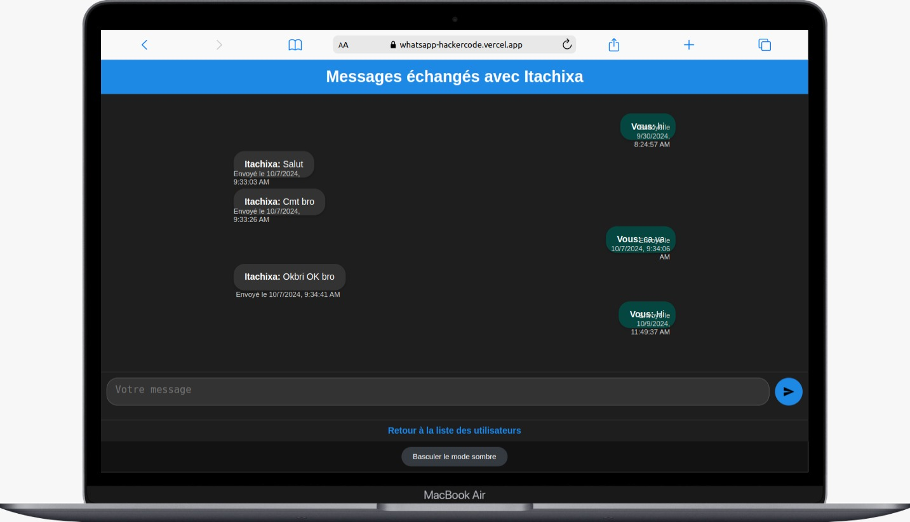

## Messager with my friend 

### friend-message

- **Description**:Moi et mon ami Kleist (Zeus Flutter) avons réalisé ce petit projet de discussion à distance en utilisant ExpressJS plus la  base de données en ligne Neon.tech pour pouvoir stocker et afficher les messages transmis et reçus par les utilisateurs. Bien sûr, nous n'avons pas oublié les règles de sécurité capturant les mots de passe des utilisateurs en utilisant un hash et des clé de cryptage  unique
